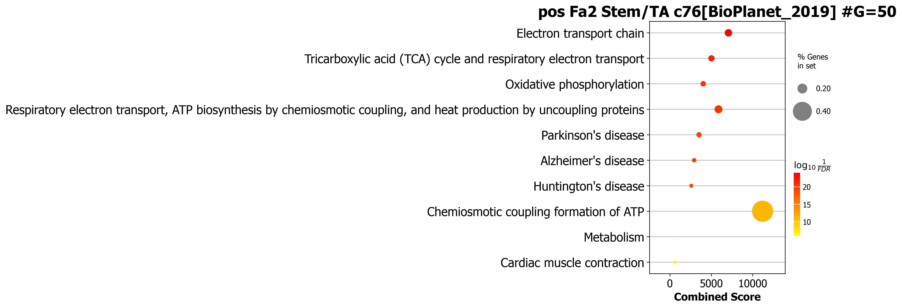
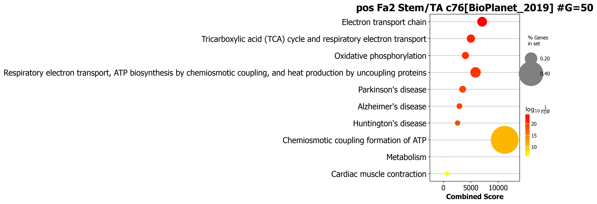

# NiCo_v2

In the original version of NiCo cell type niche interactions plot was not good due to darker color used in the color map. 
Now I found a way to make the color opacity reduced and it can be used in the following way. 

```
celltype_niche_interaction_cutoff=0.1

sint.plot_niche_interactions_without_edge_weight(niche_pred_output,
niche_cutoff=celltype_niche_interaction_cutoff,
saveas=saveas,transparent_mode=transparent_mode,
showit=True,figsize=(10,7),dpi=300,input_colormap='jet',
with_labels=True,node_size=500,linewidths=0.5, node_font_size=6, alpha=0.5,font_weight='bold')
```

<div align="center">

</div>


```
sint.plot_niche_interactions_with_edge_weight(niche_pred_output,
niche_cutoff=celltype_niche_interaction_cutoff,
saveas=saveas,transparent_mode=transparent_mode,
showit=True,figsize=(10,7),dpi=300,input_colormap='winter',
with_labels=True,node_size=300,linewidths=1, node_font_size=8, alpha=0.1,font_weight='normal',
edge_label_pos=0.35,edge_font_size=3)
```

<div align="center">

</div>


If you want to get barplot in pathway then use `display_plot_as='barplot'` in the following commands. 

```
scov.pathway_analysis(cov_out,
choose_celltypes=['Stem/TA'],
NOG_pathway=50,
choose_factors_id=[2],
positively_correlated=True,
savefigure=True,
saveas='pdf',
correlation_with_spearman=True,
rps_rpl_mt_genes_included=False,
circlesize=12,
pathwayCutoff=0.5,
pathwayorganism='Mouse',
display_plot_as='barplot',
fontsize=12,
database=['GO_Biological_Process_2021','BioPlanet_2019','Reactome_2016'])
```


<div align="center">

  
  
</div>


In the earlier dotplot you can control the size of dot using `circlesize=10` command. 
```
scov.pathway_analysis(cov_out,
choose_celltypes=['Stem/TA'],
NOG_pathway=50,
choose_factors_id=[2],
positively_correlated=True,
savefigure=True,
saveas='png',
correlation_with_spearman=True,
rps_rpl_mt_genes_included=False,
circlesize=10,
pathwayCutoff=0.5,
pathwayorganism='Mouse',
display_plot_as='dotplot',
fontsize=12,
database=['BioPlanet_2019'])
```

The output for circlesize 10 and 20 as follows. 
<div align="center">
  
  

</div>
