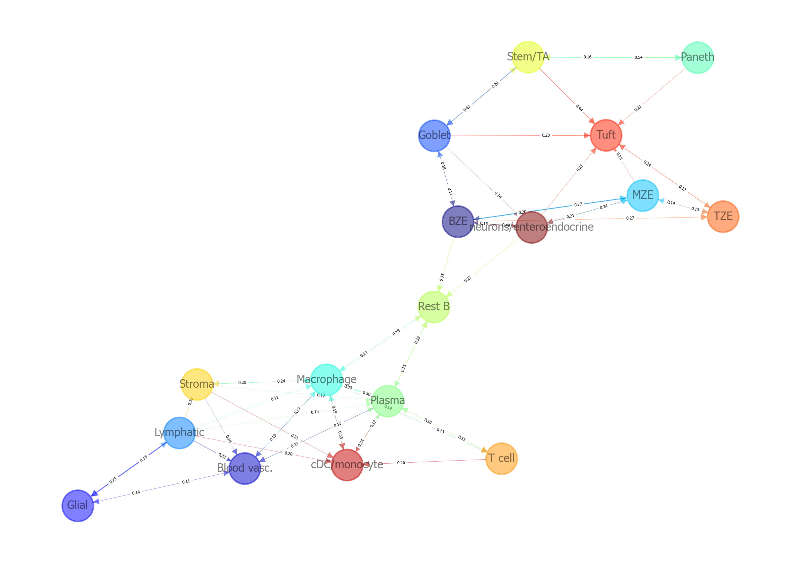

# NiCo_v2

## Niche Visualization 
In the original version of NiCo, the cell type niche interactions plots had issues with visibility due to the use of darker colors used in the colormap. 
In this version, you can reduce the opacity of colors using the `alpha` parameter and change the colormap with `input_colormap`. 
The popoular choice of colormaps are following: 
'summer', 'autumn', 'winter', 'cool', 'Wistia',  'hot', 'afmhot', 'gist_heat', 'copper','Diverging', 'PiYG', 'PRGn', 'BrBG', 'PuOr', 'RdGy', 'RdBu', 'RdYlBu', 'RdYlGn', 'Spectral', 'coolwarm', 'bwr', 'seismic', 'flag', 'prism', 'ocean', 'gist_earth', 'terrain', 'gist_stern','gist_rainbow', 'rainbow', 'jet', 'turbo' 

For more detail colormap options, refer to the [matplotlib colormap reference](https://matplotlib.org/stable/gallery/color/colormap_reference.html)
Here's is an example of how to use these options. 

```
celltype_niche_interaction_cutoff=0.1
saveas='png'
transparent_mode=False

sint.plot_niche_interactions_without_edge_weight(niche_pred_output,
niche_cutoff=celltype_niche_interaction_cutoff,
saveas=saveas,
transparent_mode=transparent_mode,
showit=True,
figsize=(10,7),
dpi=300, #Resolution in dots per inch for saving the figure.
input_colormap='jet', #Colormap for node colors, from matplotlib colormaps.
with_labels=True, #Display cell type labels on the nodes, if True.
node_size=500,  #Size of the nodes. 
linewidths=0.5, #Width of the node border lines. 
node_font_size=6, #Font size for node labels.
alpha=0.5, #Opacity level for nodes and edges. 1 is fully opaque, and 0 is fully transparent. 
font_weight='bold' # Font weight for node labels; 'bold' for emphasis, 'normal' otherwise. 
)
```

<div align="center">

</div>

Using edge weights included in the niche interaction plot can be done as shown below: 

```
sint.plot_niche_interactions_with_edge_weight(niche_pred_output,
niche_cutoff=celltype_niche_interaction_cutoff,
saveas=saveas,
transparent_mode=transparent_mode,
showit=True,
figsize=(10,7),
dpi=300,
input_colormap='winter',
with_labels=True,
node_size=300,
linewidths=1,
node_font_size=8,
alpha=0.1,
font_weight='normal',
edge_label_pos=0.35, #Relative position of the weight label along the edge. 
edge_font_size=3 # Font size for edge labels.  
)
```

<div align="center">

</div>


## Pathway Visualization 

To visualize pathways with a bar plot, set `display_plot_as='barplot'` as shown below: 

```
scov.pathway_analysis(cov_out,
choose_celltypes=['Stem/TA'],          #analysis will be performed for all cell types.
NOG_pathway=50,                        #Number of top genes associated with latent factors.  
choose_factors_id=[2],
positively_correlated=True,            #selects positively correlated genes for enrichment analysis; otherwise, selects negatively correlated genes.
savefigure=True,
saveas='pdf',
correlation_with_spearman=True,        #uses Spearman correlation coefficient for gene-factor association; otherwise, use cosine similarity.
rps_rpl_mt_genes_included=False,       #If True, include rps, rpl, and mt- genes in the pathway enrichment analysis; if False, exclude these genes. 
circlesize=12,                         #The size of the dots in the dot plots in pathway enrichment visualization. Increase this value to control marker size in the visualization.
pathwayCutoff=0.05,                    #Cutoff – Show enriched terms which Adjusted P-value < cutoff. For details see here https://gseapy.readthedocs.io/en/latest/run.html 
pathwayorganism='Mouse',
display_plot_as='barplot',             #The format for displaying the pathway analysis plot, either 'barplot' or 'dotplot'.
fontsize=12,                           #The font size for labels in the pathway visualization plots.
database=['GO_Biological_Process_2021','BioPlanet_2019','Reactome_2016'],
#See details to find available databases https://gseapy.readthedocs.io/en/latest/gseapy_example.html
input_colormap='autumn_r'              #The color map used for visualizing the pathways, available from matplotlib.
)
```


<div align="center">

  
  
</div>


In the original dotplot visualization, you can adjust the dot size with `circlesize` parameter as shown below. 
```
scov.pathway_analysis(cov_out,
choose_celltypes=['Stem/TA'],
NOG_pathway=50,
choose_factors_id=[2],
positively_correlated=True,
savefigure=True,
saveas='png',
correlation_with_spearman=True,
rps_rpl_mt_genes_included=False,
circlesize=20,
pathwayCutoff=0.5,
pathwayorganism='Mouse',
display_plot_as='dotplot',
fontsize=12,
database=['BioPlanet_2019'])
```

The output for circlesize 10 and 20 as follows. 
<div align="center">
  
  

</div>
